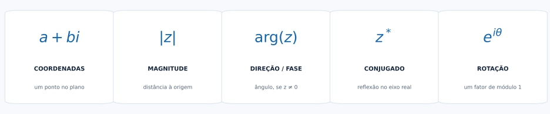
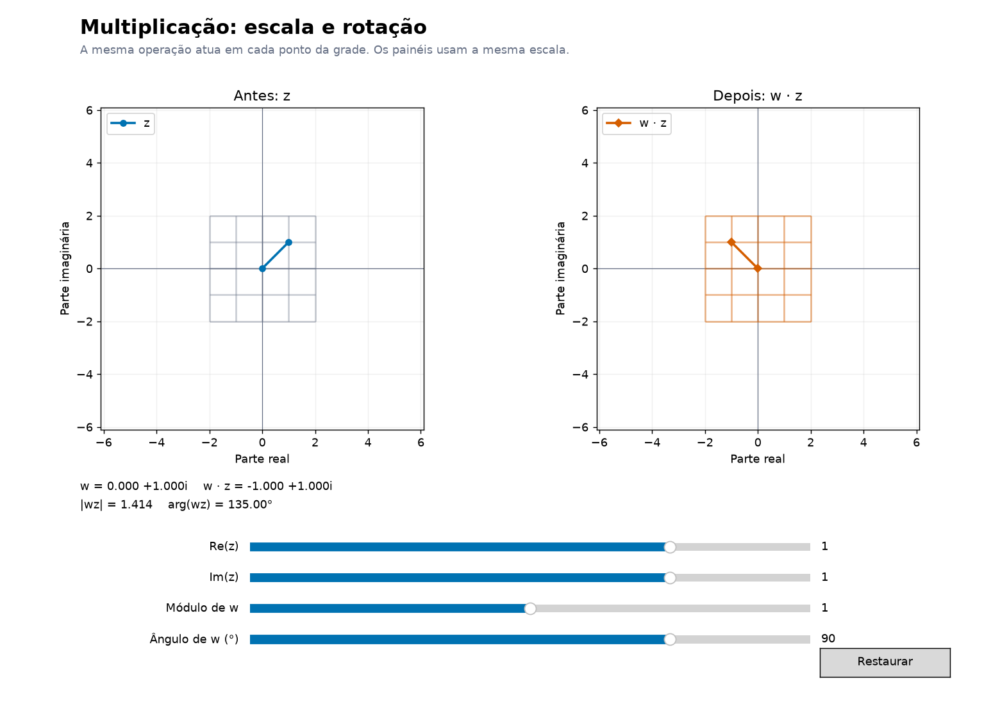

# Números Complexos para Computação Quântica

Uma exploração visual e interativa de magnitude, fase, rotação e da matemática que mais tarde aparece nas amplitudes quânticas.


**[Comece a leitura](docs/01_plano_complexo.md)** · **[Explore os laboratórios](#laboratório-interativo)** · **[Veja as aplicações](docs/09_onde_sao_usados.md)**

Um pequeno livro aberto para ver a matemática acontecer. Os capítulos combinam explicações, geometria e demonstrações em Python; os notebooks permitem mudar parâmetros e observar relações. Você pode explorar números complexos por interesse em matemática, física ou computação, mesmo sem conhecer computação quântica.

## Explore antes de estudar


Uma volta mantém o módulo e muda as componentes. **[Ver uma imagem estática](assets/book/euler_poster.png).** A animação é uma prévia; os controles funcionam nos notebooks com um kernel ativo.

| Uma descoberta | O que observar | Onde explorar |
|---|---|---|
| **Mova um número pelo plano** · $a+bi$ | Coordenadas, módulo, argumento e conjugado | [Plano e conjugado](notebooks/06_laboratorio_interativo.ipynb#plano) |
| **Rotacione com números complexos** · $ze^{i\theta}$ | Um vetor e uma grade giram sem mudar de tamanho | [Multiplicação](notebooks/06_laboratorio_interativo.ipynb#multiplicacao) |
| **Veja Euler geometricamente** · $e^{i\theta}$ | O círculo se projeta em seno e cosseno | [Euler em 3D](notebooks/06_laboratorio_interativo.ipynb#euler) |
| **Encontre uma ponte quântica** · $\alpha=re^{i\varphi}$ | Compare como a fase relativa afeta duas bases de medição | [Amplitudes normalizadas](notebooks/06_laboratorio_interativo.ipynb#amplitudes) |

## Uma ideia, várias representações



## Trilha de conhecimento

Cada parada leva à explicação correspondente. Siga as setas ou entre pela ideia que despertou sua curiosidade.

<p align="center">
  <a href="docs/01_plano_complexo.md#por-que-complexos">Por que números complexos?</a> →
  <a href="docs/01_plano_complexo.md#unidade-imaginaria">A unidade imaginária</a> →
  <a href="docs/01_plano_complexo.md#forma-cartesiana">Forma a + bi</a><br>
  ↓<br>
  <a href="docs/01_plano_complexo.md#plano-complexo">Plano complexo</a> →
  <a href="docs/01_plano_complexo.md#geometria">Geometria</a> →
  <a href="docs/02_modulo_argumento.md#modulo">Módulo</a><br>
  ↓<br>
  <a href="docs/02_modulo_argumento.md#argumento">Argumento</a> →
  <a href="docs/03_conjugado.md#conjugado">Conjugado</a> →
  <a href="docs/05_operacoes_geometricas.md#soma">Operações</a><br>
  ↓<br>
  <a href="docs/04_forma_polar_euler.md#forma-polar">Forma polar</a> →
  <a href="docs/04_forma_polar_euler.md#euler">Euler</a> →
  <a href="docs/04_forma_polar_euler.md#circulo-unitario">Círculo unitário</a><br>
  ↓<br>
  <a href="docs/05_operacoes_geometricas.md#rotacoes">Rotações</a> →
  <a href="docs/08_raizes_da_unidade.md#raizes">Raízes da unidade</a> →
  <a href="docs/09_onde_sao_usados.md#fase">Fase</a><br>
  ↓<br>
  <a href="docs/09_onde_sao_usados.md#ondas">Ondas e outras aplicações</a> →
  <a href="docs/06_ponte_para_qubits.md#amplitudes">Amplitudes complexas</a> →
  <a href="docs/06_ponte_para_qubits.md#estado-qubit">Primeira conexão quântica</a>
</p>

## Laboratório interativo

**[Explorar números complexos →](notebooks/06_laboratorio_interativo.ipynb)**

[](notebooks/06_laboratorio_interativo.ipynb)

Dez experiências em dois notebooks. Nos gráficos 3D, arrastar a câmera muda o ponto de vista.

- **[Geometria e amplitudes](notebooks/06_laboratorio_interativo.ipynb):** plano e conjugado, soma, multiplicação, Euler em 3D, potências, módulo ao quadrado e amplitudes.
- **[Raízes, ondas e Fourier](notebooks/07_raizes_ondas_fourier.ipynb):** três janelas para aplicações.
- **[Como abrir e usar os controles](docs/07_laboratorio_interativo.md):** execução local e [publicação com Binder](docs/07_laboratorio_interativo.md#publicar-com-binder).

O GitHub mostra texto, figuras e a prévia dos notebooks. Para manipular os gráficos, abra o JupyterLab localmente; não há um laboratório hospedado neste momento.

## Quatro passos que voltam ao início


$i^4=1$ ganha uma interpretação visual. A mesma ideia leva a [polígonos regulares e raízes da unidade](docs/08_raizes_da_unidade.md), que reaparecem em Fourier.

## Onde números complexos são usados?

Uma rotação, uma onda com defasagem, a resposta de um circuito e um coeficiente de Fourier compartilham a linguagem de **magnitude + fase**. [Conheça essas aplicações](docs/09_onde_sao_usados.md), com demonstrações de sinais e sistemas dinâmicos.

## Janela para o mundo quântico


Na base $|0\rangle,|1\rangle$, um estado puro normalizado tem probabilidades $|\alpha|^2$ e $|\beta|^2$. A fase relativa ajuda a explicar por que probabilidades iguais nessa base não descrevem toda a informação do estado. [Atravesse essa primeira ponte](docs/06_ponte_para_qubits.md).

## Abra o livro no seu computador

Na pasta do projeto:

```bash
python -m venv .venv
```

Ative o ambiente com `.venv\Scripts\Activate.ps1` no PowerShell ou `source .venv/bin/activate` no Linux/macOS. Depois:

```bash
python -m pip install -r requirements-interactive.txt
python -m jupyterlab
```

O arquivo inclui as dependências básicas e o backend interativo. O [guia](docs/07_laboratorio_interativo.md) traz a alternativa com `uv`, seleção do kernel e solução de problemas.

<details>
<summary>Reproduzir as figuras e conferir o código</summary>

```bash
python scripts/generate_book_assets.py
python scripts/explore_geometry.py todos --output assets/interactive
python -m pytest -q
python scripts/validate_book_links.py
python scripts/validate_notebooks.py --output assets/interactive/notebook-validation.json
```

As figuras matemáticas são geradas por código. O GIF não precisa de `ffmpeg`. Os módulos ficam em `src/`, as explicações em `docs/` e as demonstrações em `notebooks/`.

</details>

## Para continuar a descoberta

[Referências comentadas](docs/REFERENCIAS.md) · [Filosofia do livro](PROJECT_PLAN.md) · [Registro de revisão técnica](docs/AUDITORIA_E_MELHORIAS.md)

Este material cobre números complexos e uma introdução às amplitudes. Vetores complexos, produto interno, bases e matrizes são os próximos passos para estudar computação quântica com mais profundidade.
