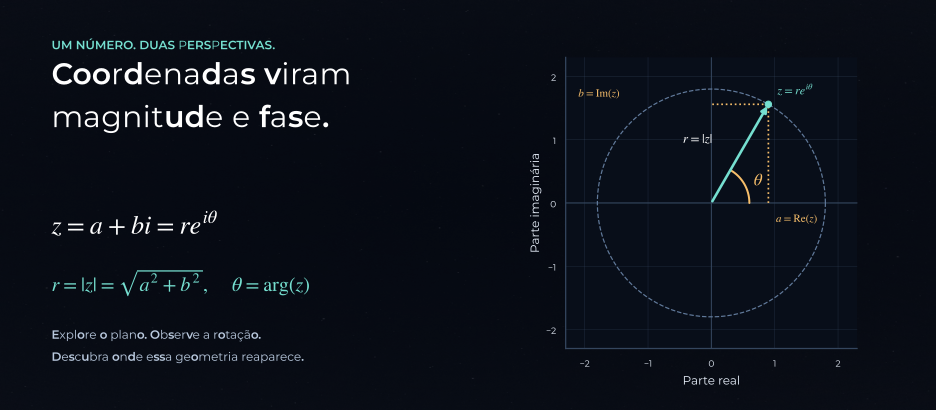
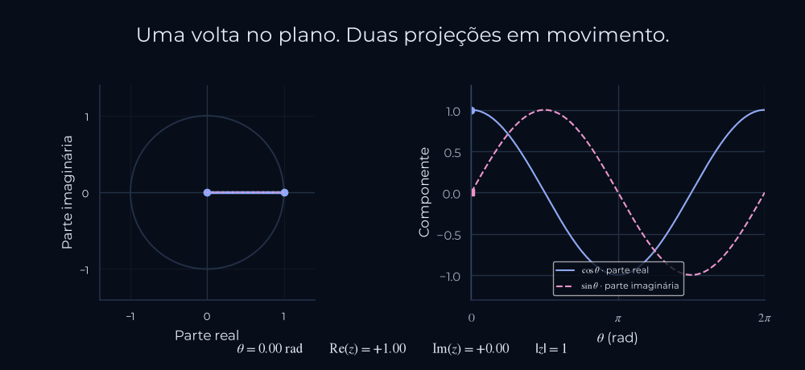
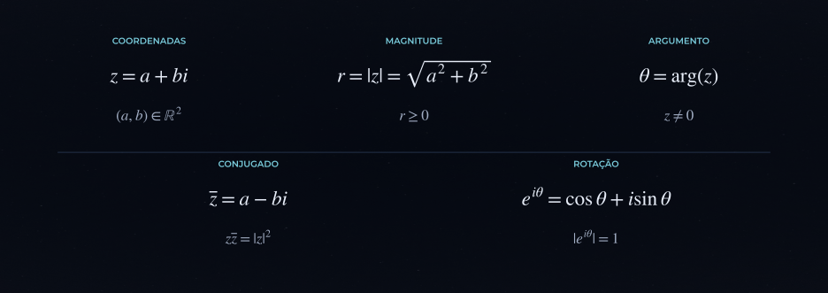
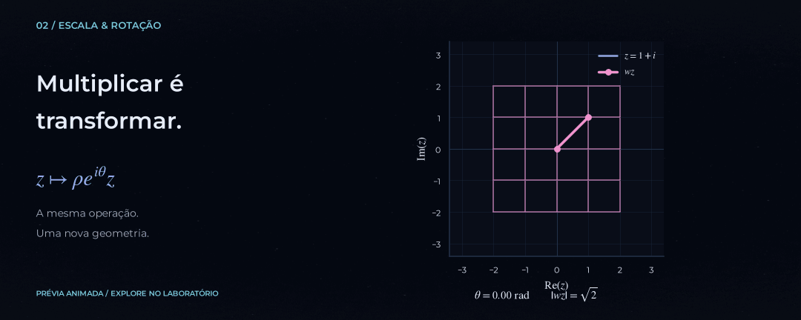
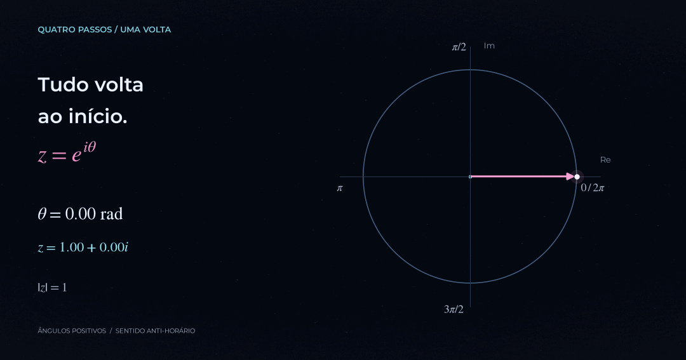
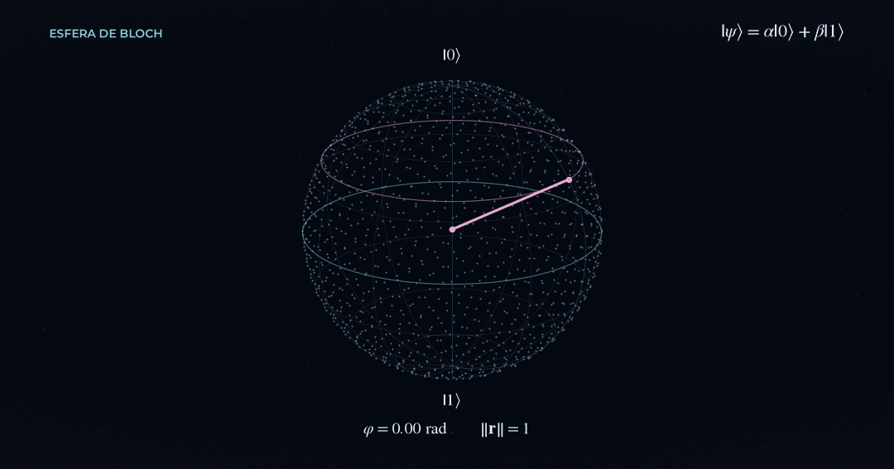

# Números Complexos para Computação Quântica

**Um livro visual sobre magnitude, fase e as primeiras ideias da computação quântica.**



**[Abrir o laboratório no navegador →](#abrir-o-laboratório-no-navegador)** · [Começar a leitura](docs/01_plano_complexo.md) · [Explorar as aplicações](docs/09_onde_sao_usados.md)

Um ponto vira um vetor. Uma multiplicação vira uma rotação. Duas amplitudes complexas abrem uma janela para o qubit. Explore essas relações com gráficos, notação matemática e experiências que respondem aos seus controles.

## Explore antes de estudar

[](#abrir-o-laboratório-no-navegador)

$$z=re^{i\theta}=r\cos\theta+ir\sin\theta$$

**Uma volta. Duas projeções.** O módulo permanece; as componentes real e imaginária oscilam. [Ver sem movimento](assets/book/euler_poster.png).

> As animações se movem aqui no README. Para arrastar gráficos, mudar parâmetros e girar a esfera 3D, [abra o laboratório interativo](#abrir-o-laboratório-no-navegador). O GitHub não executa JavaScript dentro de arquivos Markdown.

## Uma ideia, várias representações



## Trilha de conhecimento

Cada parada abre um capítulo de leitura. Experimente a geometria no [laboratório do navegador](#abrir-o-laboratório-no-navegador) ou acompanhe o código nos [notebooks](#abra-o-livro-no-seu-computador).

[](docs/01_plano_complexo.md#por-que-complexos)

[Por que complexos?](docs/01_plano_complexo.md#por-que-complexos) · [Unidade imaginária](docs/01_plano_complexo.md#unidade-imaginaria) · [Forma cartesiana](docs/01_plano_complexo.md#forma-cartesiana)

[](docs/01_plano_complexo.md#plano-complexo)

[Plano complexo](docs/01_plano_complexo.md#plano-complexo) · [Geometria](docs/01_plano_complexo.md#geometria) · [Módulo](docs/02_modulo_argumento.md#modulo)

[](docs/02_modulo_argumento.md#argumento)

[Argumento](docs/02_modulo_argumento.md#argumento) · [Conjugado](docs/03_conjugado.md#conjugado) · [Operações](docs/05_operacoes_geometricas.md#soma)

[](docs/04_forma_polar_euler.md#forma-polar)

[Forma polar](docs/04_forma_polar_euler.md#forma-polar) · [Fórmula de Euler](docs/04_forma_polar_euler.md#euler) · [Círculo unitário](docs/04_forma_polar_euler.md#circulo-unitario)

[](docs/05_operacoes_geometricas.md#rotacoes)

[Rotações](docs/05_operacoes_geometricas.md#rotacoes) · [Raízes da unidade](docs/08_raizes_da_unidade.md#raizes) · [Fase](docs/09_onde_sao_usados.md#fase)

[](docs/06_ponte_para_qubits.md#amplitudes)

[Ondas e aplicações](docs/09_onde_sao_usados.md#ondas) · [Amplitudes complexas](docs/06_ponte_para_qubits.md#amplitudes) · [Estado de um qubit](docs/06_ponte_para_qubits.md#estado-qubit)

## Laboratório interativo

**Mude a escala. Escolha um ângulo. Veja o plano inteiro se transformar.**

[](#abrir-o-laboratório-no-navegador)

$$w=\rho e^{i\theta}\quad\Longrightarrow\quad |wz|=\rho|z|$$

O laboratório com **Plotly e Three.js** reúne quatro experiências com controles: plano complexo, escala e rotação, Euler e esfera de Bloch. Inclui animação com pausa, leitura de coordenadas, controle por teclado e câmera 3D. [Ver a prévia sem movimento](assets/book/laboratorio_poster.png).

Os notebooks complementam essa experiência com onze laboratórios:

- **[Geometria e amplitudes](notebooks/06_laboratorio_interativo.ipynb):** plano e conjugado, soma, multiplicação, Euler em 3D, potências, módulo ao quadrado, amplitudes e esfera de Bloch.
- **[Raízes, ondas e Fourier](notebooks/07_raizes_ondas_fourier.ipynb):** três janelas para aplicações.
- **[Como abrir e usar os controles](docs/07_laboratorio_interativo.md):** execução local e [publicação com Binder](docs/07_laboratorio_interativo.md#publicar-com-binder).

### Abrir o laboratório no navegador

**No projeto baixado:** abra [docs/laboratorio.html](docs/laboratorio.html) com um navegador. O arquivo inclui Plotly e Three.js e funciona sem instalar Python; somente a renderização das fórmulas por MathJax requer internet. No GitHub, use **Download raw file** nessa página e abra o HTML baixado.

**Durante o desenvolvimento:** na raiz do projeto, execute `python -m http.server 8892 --bind 127.0.0.1` e abra `http://127.0.0.1:8892/docs/laboratorio.html`.

**Para oferecer um link público:** [publique esse mesmo HTML no GitHub Pages](docs/07_laboratorio_interativo.md#publicar-o-laboratório-plotly). A versão local já está pronta; a publicação depende da configuração de Pages no repositório.

## Quatro passos que voltam ao início

[](#abrir-o-laboratório-no-navegador)

$z=e^{i\theta}$ completa uma volta no sentido positivo, anti-horário. O ponteiro pausa **1 segundo** em $\pi/2$, $\pi$, $3\pi/2$ e $2\pi$, mostrando $i$, $-1$, $-i$ e $1$. [Ver sem movimento](assets/book/quatro_rotacoes_poster.png). A mesma ideia leva às [raízes da unidade](docs/08_raizes_da_unidade.md).

## Onde números complexos são usados?

Uma rotação, uma onda com defasagem, a resposta de um circuito e um coeficiente de Fourier compartilham a linguagem de **magnitude + fase**. [Conheça essas aplicações](docs/09_onde_sao_usados.md), com demonstrações de sinais e sistemas dinâmicos.

## Janela para o mundo quântico

[](#abrir-o-laboratório-no-navegador)

$$|\psi\rangle=\alpha|0\rangle+\beta|1\rangle,\qquad |\alpha|^2+|\beta|^2=1$$

$$\mathbf r=\left(2\operatorname{Re}(\alpha^*\beta),\;2\operatorname{Im}(\alpha^*\beta),\;|\alpha|^2-|\beta|^2\right)$$

**Uma esfera. O estado em destaque.** No laboratório, o modelo **Three.js** permite girar a câmera e aproximar a esfera. Magnitudes mudam a latitude; fase relativa muda o azimute; fase global preserva o vetor. [Ver a prévia sem movimento](assets/book/bloch_poster.png).

Na base $|0\rangle,|1\rangle$, um estado puro normalizado tem probabilidades $|\alpha|^2$ e $|\beta|^2$. A fase relativa ajuda a explicar por que probabilidades iguais nessa base não descrevem toda a informação do estado. [Atravesse essa primeira ponte](docs/06_ponte_para_qubits.md).

## Abra o livro no seu computador

Na pasta do projeto:

```bash
python -m venv .venv
```

Ative o ambiente com `.venv\Scripts\Activate.ps1` no PowerShell ou `source .venv/bin/activate` no Linux/macOS. Depois:

```bash
python -m pip install -r requirements-interactive.txt
python -m jupyterlab notebooks/06_laboratorio_interativo.ipynb
```

O arquivo inclui as dependências básicas e o backend interativo. O [guia](docs/07_laboratorio_interativo.md) traz a alternativa com `uv`, seleção do kernel e solução de problemas.

No JupyterLab, escolha **Run → Run All Cells** e aguarde a execução. Os controles passam a responder ao mouse; a última experiência mostra a esfera de Bloch e as amplitudes complexas. Mantenha o terminal do Jupyter aberto durante o uso.

<details>
<summary>Reproduzir as figuras e conferir o código</summary>

```bash
python scripts/generate_book_assets.py
python scripts/build_web_lab.py
python scripts/explore_geometry.py todos --output assets/interactive
python -m pytest -q
python scripts/validate_book_links.py
python scripts/validate_notebooks.py --output assets/interactive/notebook-validation.json
```

**Three.js** renderiza a esfera; **Plotly** cuida dos gráficos 2D; **Seaborn** define a paleta e o tema; **LaTeX** expressa as fórmulas, renderizadas por MathJax no HTML e MathText nas imagens. Os textos usam **Montserrat**. O [fundo noturno, a fonte e suas licenças](assets/THIRD_PARTY.md) estão incluídos no projeto. As animações não precisam de `ffmpeg`. Os módulos ficam em `src/`, o código da página em `assets/web/`, as explicações em `docs/` e as demonstrações em `notebooks/`.

Com Node.js 18 ou superior, `node tests/check_web_lab.cjs` verifica a matemática das quatro experiências no navegador sem dependências extras.

</details>

## Para continuar a descoberta

[Referências comentadas](docs/REFERENCIAS.md) · [Filosofia do livro](PROJECT_PLAN.md) · [Registro de revisão técnica](docs/AUDITORIA_E_MELHORIAS.md)

Este material cobre números complexos e uma introdução às amplitudes. Vetores complexos, produto interno, bases e matrizes são os próximos passos para estudar computação quântica com mais profundidade.
