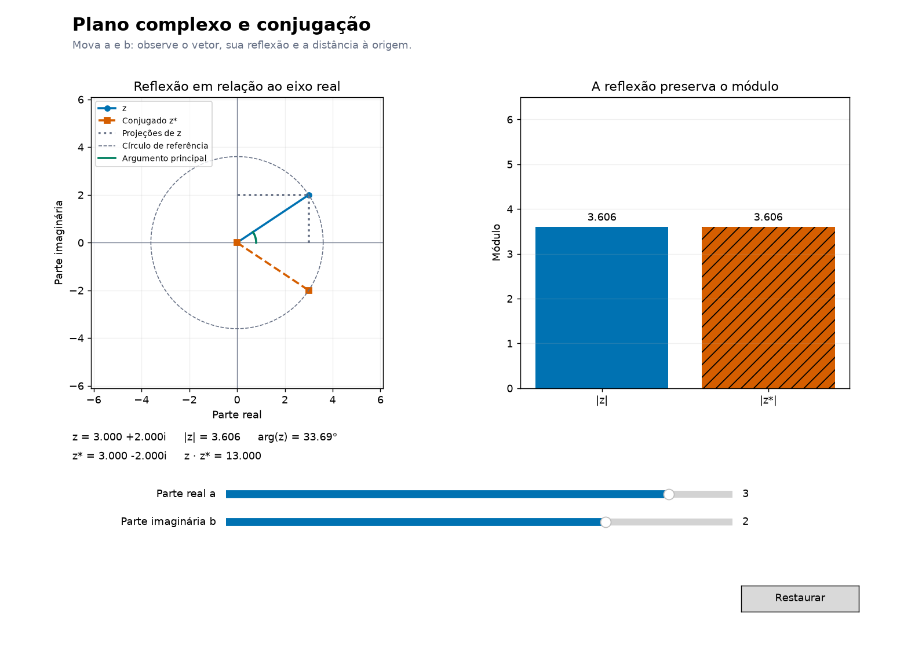

# Conjugado: o espelho que produz um número real

[← Módulo e argumento](02_modulo_argumento.md) · [Entrada](../README.md) · [Operações →](05_operacoes_geometricas.md)

O que acontece quando invertemos apenas a coordenada vertical? O ponto atravessa o eixo real como sua imagem num espelho.

<a id="conjugado"></a>
## Uma reflexão escrita em álgebra

$$z=a+bi\quad\longrightarrow\quad z^*=\overline z=a-bi.$$



No gráfico, a linha contínua representa $z$ e a tracejada representa $z^*$. Compare $3+4i$ e $3-4i$ no [laboratório](../notebooks/06_laboratorio_interativo.ipynb#plano). Ambos têm módulo 5. Refletir duas vezes retorna ao ponto inicial: $(z^*)^*=z$.

## Observe as partes imaginárias se cancelarem

Multiplicar o número por seu conjugado produz:

$$zz^*=(a+bi)(a-bi)=a^2-abi+abi-b^2i^2=a^2+b^2=|z|^2.$$

Os termos cruzados se cancelam. O resultado é real e não negativo, embora os fatores possam ser complexos.

```python
z = 3 + 4j
print(z.conjugate())       # (3-4j)
print(z * z.conjugate())   # (25+0j)
print(abs(z)**2)           # 25.0
```

> **Uma consequência útil**
> Para $w\ne0$, multiplicar numerador e denominador por $w^*$ dá
> $\displaystyle\frac{z}{w}=\frac{zw^*}{|w|^2}$.
> O denominador se torna real. Por exemplo, $1/(1+i)=(1-i)/2$.

## Uma leitura em termos de fase

Quando escrevermos $z=re^{i\theta}$, o reflexo será $z^*=re^{-i\theta}$. A conjugação preserva o módulo e troca o sinal do ângulo, considerando direções equivalentes por voltas completas. Em $z=0$, essa descrição não define um ângulo único.

## Onde isso reaparece em computação quântica?

O mesmo produto $\alpha^*\alpha=|\alpha|^2$ participa das probabilidades. Mais adiante, o produto interno de vetores complexos terá a forma $u^\dagger v=\sum_k u_k^*v_k$. O símbolo $\dagger$ combina conjugação e transposição: esta é uma janela para álgebra linear e notação bra-ket, não uma nova regra de probabilidade para qualquer vetor.

## Para aprofundar

[MIT — conjugação e módulo, §§1.3–1.5](https://ocw.mit.edu/courses/18-04-complex-variables-with-applications-spring-2018/6eae09885b0fab3f068e31752198abea_MIT18_04S18_topic1.pdf) · [IBM — estados como vetores complexos](https://quantum.cloud.ibm.com/learning/en/courses/basics-of-quantum-information/single-systems/quantum-information).

**[Continue: operações que movem o plano →](05_operacoes_geometricas.md)**
