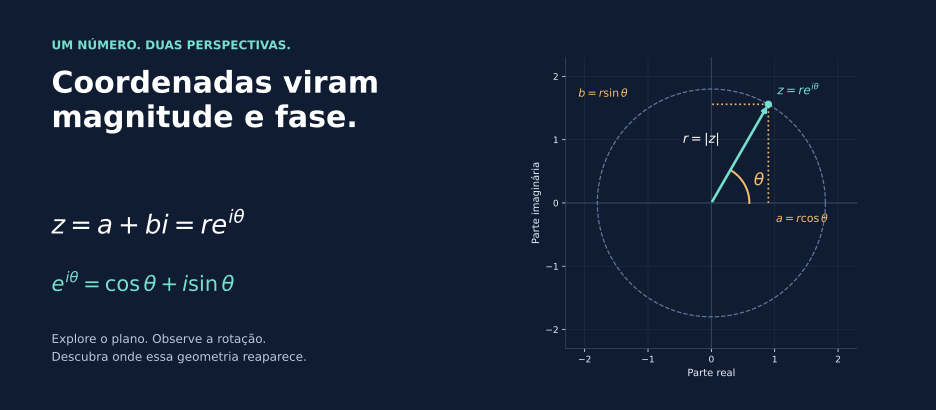
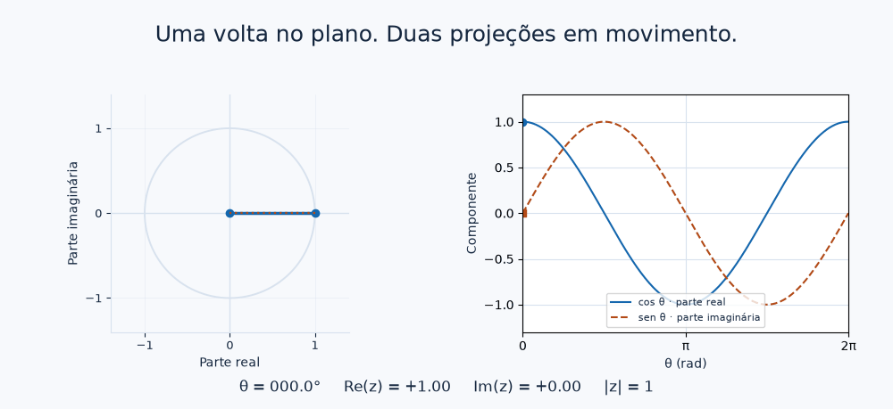

# Forma polar e Euler: o círculo dentro da exponencial

[← Operações](05_operacoes_geometricas.md) · [Entrada](../README.md) · [Raízes da unidade →](08_raizes_da_unidade.md)

Coordenadas cartesianas tornam a soma simples. Para entender rotações, vale trocar as duas coordenadas por distância e ângulo.

<a id="forma-polar"></a>
## A mesma seta em outra linguagem

As projeções de uma seta de comprimento $r$ e direção $\theta$ são $a=r\cos\theta$ e $b=r\sin\theta$. Logo:

$$z=a+bi=r(\cos\theta+i\sin\theta).$$



Para $1+i$, temos $r=\sqrt2$ e $\theta=\pi/4$. De outro lado, $2(\cos(\pi/3)+i\sin(\pi/3))=1+\sqrt3\,i$. A descrição muda; o ponto permanece. Na origem, $r=0$ e qualquer valor colocado em $\theta$ produz o mesmo zero, sem definir seu argumento.

<a id="euler"></a>
## A fórmula de Euler

$$e^{i\theta}=\cos\theta+i\sin\theta,\qquad z=re^{i\theta}.$$

Para além de uma abreviação, essa identidade conecta a exponencial complexa às funções trigonométricas. Uma demonstração usa suas séries convergentes: em $e^{i\theta}$, as potências pares de $i$ produzem a série do cosseno e as ímpares, $i$ vezes a série do seno. Séries infinitas são uma janela para cálculo; a geometria pode ser explorada antes delas. [MIT, §1.6](https://ocw.mit.edu/courses/18-04-complex-variables-with-applications-spring-2018/6eae09885b0fab3f068e31752198abea_MIT18_04S18_topic1.pdf).

<a id="circulo-unitario"></a>
## Uma volta, duas projeções



[Versão estática da figura](../assets/book/euler_poster.png).

Quando $r=1$, o vetor percorre o círculo unitário. A igualdade $\cos^2\theta+\sin^2\theta=1$ confirma seu módulo constante.

| Ângulo | Ponto $e^{i\theta}$ | Direção |
|---|---|---|
| $0$ | $1$ | direita |
| $\pi/2$ | $i$ | acima |
| $\pi$ | $-1$ | esquerda |
| $3\pi/2$ | $-i$ | abaixo |

```python
import cmath
import math

z = cmath.rect(2, math.pi/3)
print(z)       # Aproximadamente 1 + 1.73205j
print(abs(z))  # Aproximadamente 2
```

O [notebook de Euler](../notebooks/04_forma_polar_euler.ipynb) mostra esses pontos. No [laboratório 3D](../notebooks/06_laboratorio_interativo.ipynb#euler), acrescente o parâmetro $t$ como terceiro eixo: o círculo se desdobra em uma hélice $(\operatorname{Re}z(t),\operatorname{Im}z(t),t)$. Esse eixo extra registra o percurso; não acrescenta uma terceira componente ao número complexo.

> **Uma consequência surpreendente**
> Em meia volta, $e^{i\pi}=-1$. Portanto, $e^{i\pi}+1=0$. A identidade de Euler é um caso particular da mesma curva que a animação percorre.

## Onde isso reaparece em computação quântica?

Fatores $e^{i\varphi}$ descrevem fases com módulo 1. Multiplicar todas as amplitudes de um estado pelo mesmo fator produz uma fase global; alterar a relação entre as fases pode mudar o estado físico. A [ponte quântica](06_ponte_para_qubits.md#fase-relativa) mostra uma primeira comparação.

## Para aprofundar

[MIT — exponencial complexa](https://ocw.mit.edu/courses/18-04-complex-variables-with-applications-spring-2018/6eae09885b0fab3f068e31752198abea_MIT18_04S18_topic1.pdf) · [OpenStax — forma polar e potências](https://openstax.org/books/algebra-and-trigonometry-2e/pages/10-5-polar-form-of-complex-numbers) · [IBM — fases global e relativa](https://quantum.cloud.ibm.com/learning/en/courses/basics-of-quantum-information/quantum-circuits/limitations-on-quantum-information).

**[Reveja a multiplicação usando Euler](05_operacoes_geometricas.md#multiplicacao)** · **[Continue: raízes da unidade →](08_raizes_da_unidade.md)**
