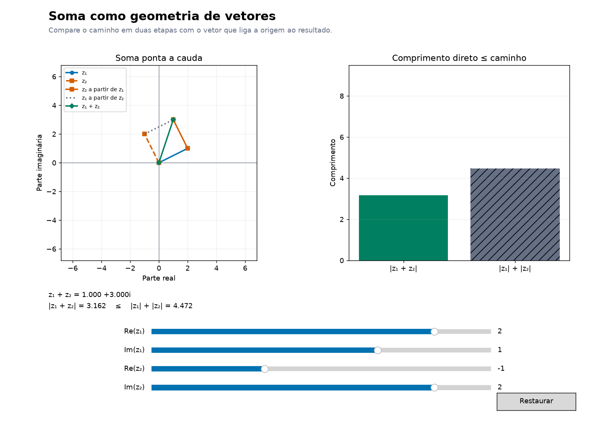
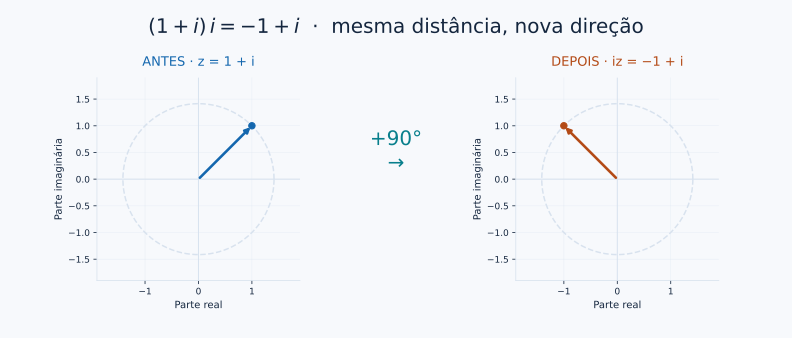
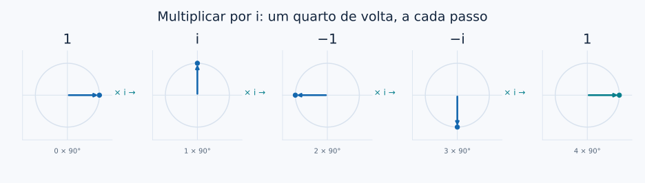

# Operações: a álgebra move o plano

[← Conjugado](03_conjugado.md) · [Entrada](../README.md) · [Forma polar e Euler →](04_forma_polar_euler.md)

Uma conta pode descrever uma transformação inteira. Somar um complexo desloca os pontos; multiplicar por um complexo combina escala e rotação.

<a id="soma"></a>
## Somar é encadear deslocamentos

$$z_1+z_2=(a+bi)+(c+di)=(a+c)+(b+d)i.$$



No exemplo, $(2+i)+(-1+2i)=1+3i$. Partimos da origem, seguimos o primeiro vetor e transportamos o segundo até sua ponta. A resultante liga a origem ao destino final.

No [laboratório de soma](../notebooks/06_laboratorio_interativo.ipynb#soma), alinhe os vetores e depois coloque-os em sentidos opostos. O caminho em duas etapas nunca fica menor que o trajeto direto:

$$|z_1+z_2|\leq |z_1|+|z_2|.$$

<a id="rotacoes"></a>
## O que acontece se multiplicarmos por i?

Começamos com $z=1+i$. A conta dá $(1+i)i=i+i^2=-1+i$. O ponto $(1,1)$ chega a $(-1,1)$.



Em geral, $i(a+bi)=-b+ai$: as coordenadas passam de $(a,b)$ para $(-b,a)$, uma rotação anti-horária de $90°$. Veja a [demonstração computacional](../notebooks/03_operacoes_geometricas.ipynb).



> **Uma consequência surpreendente**
> $i^2=-1$ é meia volta; $i^4=1$ é uma volta completa. A regra algébrica da unidade imaginária ganha uma interpretação espacial.

<a id="multiplicacao"></a>
## Multiplicar módulos e somar ângulos

A [forma polar e a fórmula de Euler](04_forma_polar_euler.md) permitem escrever:

$$z_1=r_1e^{i\theta_1},\quad z_2=r_2e^{i\theta_2}
\quad\Longrightarrow\quad z_1z_2=r_1r_2e^{i(\theta_1+\theta_2)}.$$

| Antes | Multiplicador | Depois |
|---|---|---|
| Módulo $r_1$ | Módulo $r_2$ | Módulo $r_1r_2$ |
| Direção $\theta_1$ | Ângulo $\theta_2$ | Direção $\theta_1+\theta_2$ módulo $2\pi$ |

Essa descrição dos ângulos pressupõe fatores não nulos. Multiplicar por zero leva tudo à origem, onde o argumento é indefinido.

**[Transforme a grade inteira](../notebooks/06_laboratorio_interativo.ipynb#multiplicacao).** Com multiplicador de módulo 1 e ângulo $90°$, os comprimentos permanecem; com módulo 2, eles dobram. A conta confirma a imagem:

```python
import cmath
import math

z = 1 + 1j
w = cmath.rect(2, math.pi/4)
print(z*w)       # Aproximadamente 0 + 2.828427j
print(abs(z*w))  # 2 * sqrt(2)
```

## Onde isso reaparece em computação quântica?

Fatores de módulo 1 preservam o módulo de amplitudes e ajudam a visualizar fases. Entretanto, uma multiplicação arbitrária que aumenta módulos não preserva a normalização de um estado. Operações unitárias atuam sobre o vetor completo de amplitudes; essa estrutura exige álgebra linear.

## Para aprofundar

[MIT — operações e geometria](https://ocw.mit.edu/courses/18-04-complex-variables-with-applications-spring-2018/6eae09885b0fab3f068e31752198abea_MIT18_04S18_topic1.pdf) · [OpenStax — multiplicação em forma polar](https://openstax.org/books/algebra-and-trigonometry-2e/pages/10-5-polar-form-of-complex-numbers).

**[Continue: por que a exponencial descreve uma rotação? →](04_forma_polar_euler.md)**
