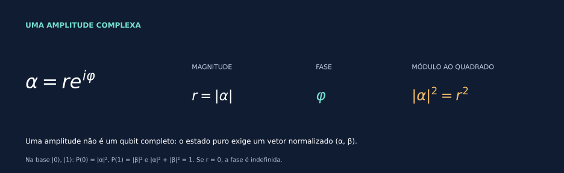
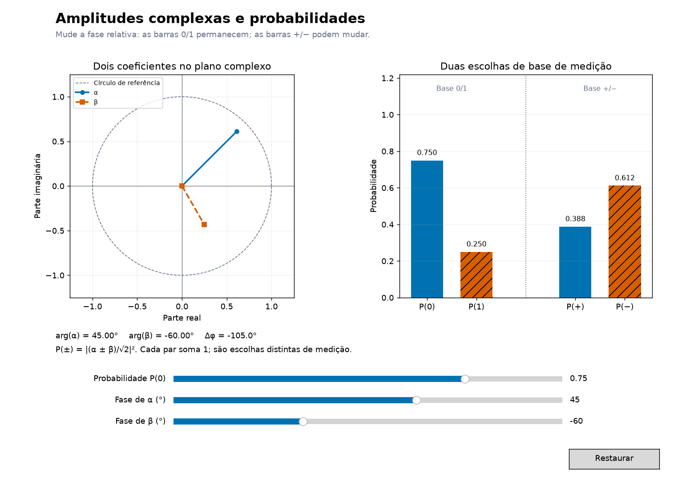

# Uma primeira ponte para qubits

[← Aplicações](09_onde_sao_usados.md) · [Entrada](../README.md) · [Laboratórios →](07_laboratorio_interativo.md)

Vimos a mesma geometria aparecer em rotações, ondas e sinais. Na computação quântica, números complexos aparecem como coeficientes de estados. A distinção essencial é entre uma amplitude e o vetor completo.

## Uma amplitude tem magnitude e fase

$$\alpha=re^{i\varphi}\quad\Longrightarrow\quad |\alpha|^2=r^2.$$

Se $r=0$, a amplitude é zero e sua fase não está definida. Para $r>0$, mudar $\varphi$ gira o vetor no plano sem alterar $|\alpha|^2$. Essa propriedade matemática, sozinha, ainda não constitui uma descrição de qubit.

## Duas amplitudes organizadas em um estado

Um **estado puro** de um qubit é representado por

$$|\psi\rangle=\alpha|0\rangle+\beta|1\rangle
\quad\leftrightarrow\quad
\begin{pmatrix}\alpha\\\beta\end{pmatrix},\qquad
|\alpha|^2+|\beta|^2=1.$$

Os símbolos $|0\rangle$ e $|1\rangle$ designam os dois vetores de uma base ortonormal. Ao medir nessa base, $P(0)=|\alpha|^2$ e $P(1)=|\beta|^2$. São números reais não negativos cuja soma é 1. Estados mistos exigem outra representação, a ser estudada posteriormente. [IBM — informação quântica](https://quantum.cloud.ibm.com/learning/en/courses/basics-of-quantum-information/single-systems/quantum-information) e [TU Delft — regra de Born](https://ocw.tudelft.nl/course-lectures/1-2-1-born-rule/).

No [laboratório de amplitudes](../notebooks/06_laboratorio_interativo.ipynb#amplitudes), $\alpha=\sqrt p\,e^{i\varphi_\alpha}$ e $\beta=\sqrt{1-p}\,e^{i\varphi_\beta}$ mantêm a normalização. Fixe $p=0{,}75$ e mova as fases: os vetores giram, mas as barras P(0) e P(1) permanecem em 0,75 e 0,25. O segundo par de barras abre a próxima descoberta.

## Mesmas barras podem esconder uma diferença

Compare dois estados normalizados:

$$|+\rangle=\frac{|0\rangle+|1\rangle}{\sqrt2},\qquad
|-\rangle=\frac{|0\rangle-|1\rangle}{\sqrt2}.$$

Nos dois, as probabilidades na base $|0\rangle,|1\rangle$ são $1/2$ e $1/2$. Porém, no segundo, a amplitude de $|1\rangle$ ganhou uma fase de $\pi$ em relação à de $|0\rangle$.

> **Janela para bases e interferência**
> Os vetores $|+\rangle,|-\rangle$ também formam uma base ortonormal. Nessa base, as coordenadas são $\gamma_+=(\alpha+\beta)/\sqrt2$ e $\gamma_-=(\alpha-\beta)/\sqrt2$. Essas combinações mostram como sinais e fases podem produzir reforço ou cancelamento.

| Estado | $P(0)$ | $P(1)$ | $P(+)$ | $P(-)$ |
|---|---|---|---|---|
| $\lvert+\rangle$ | $1/2$ | $1/2$ | $1$ | $0$ |
| $\lvert-\rangle$ | $1/2$ | $1/2$ | $0$ | $1$ |

O [notebook da ponte](../notebooks/05_ponte_para_qubits.ipynb) calcula e desenha essa comparação. As duas últimas colunas correspondem a **outra base de medição**, não a uma mudança espontânea das primeiras probabilidades. A implementação física dessa medição e a teoria geral das mudanças de base ficam para o estudo de álgebra linear e operações quânticas.

**Veja a fase mudar os resultados.** No laboratório, escolha `p0=0.5`, fase de α igual a 0° e mova a fase de β de 0° até 180°. O par P(0), P(1) continua em 0,5; o par P(+), P(−) vai de (1, 0) a (0, 1). Cada par soma 1 separadamente: são duas escolhas de medição sobre estados preparados da mesma maneira, não quatro resultados de uma única medição.

Expandindo o módulo ao quadrado, vemos de onde vem a mudança:

$$P(\pm)=\left|\frac{\alpha\pm\beta}{\sqrt2}\right|^2
=\frac12\pm\operatorname{Re}(\alpha^*\beta)
=\frac12\pm\sqrt{p(1-p)}\cos(\Delta\varphi),$$

com $\Delta\varphi=\varphi_\beta-\varphi_\alpha$ quando ambas as amplitudes são não nulas. O termo cruzado revela a interferência. Em $p=0$ ou $p=1$, ele desaparece e P(+)=P(−)=1/2; não é preciso atribuir fase à amplitude zero. A combinação de coordenadas também aparece na matriz de Hadamard, que será estudada adiante. [Aram Harrow, MIT — Quantum Computing, §2.1, pp. 3–4](https://ocw.mit.edu/courses/8-06-quantum-physics-iii-spring-2016/766eb82809dd269944b11e838ed1814b_MIT8_06S16_chap5.pdf).

## Fase global e fase relativa

Multiplicar **todas** as amplitudes por $e^{i\chi}$ produz apenas uma fase global e não muda o estado físico: em qualquer base, os coeficientes recebem o mesmo fator de módulo 1. Mudar uma fase em relação à outra, quando ambas as amplitudes são não nulas, pode alterar o estado. [IBM — fases global e relativa](https://quantum.cloud.ibm.com/learning/en/courses/basics-of-quantum-information/quantum-circuits/limitations-on-quantum-information).

Compare no laboratório as fases (0°, 90°) com (45°, 135°). As duas setas giram 45°, a diferença continua em 90° e os dois pares de barras permanecem iguais. Ao mover os controles um de cada vez, o estado intermediário tem outra fase relativa; a comparação de fase global é entre os dois ajustes completos.

> **Por que probabilidades são reais?**
> A regra usa produtos como $\alpha^*\alpha$, não a amplitude isolada. A conjugação produz $|\alpha|^2$, real e não negativo. A normalização fornece a soma unitária.

## O que essa ponte abre

Vetores complexos, produto interno, bases e matrizes unitárias explicam como combinar amplitudes rigorosamente. As [raízes da unidade](08_raizes_da_unidade.md) reaparecem na QFT; essa conexão exige ainda sistemas de vários qubits. Aqui reconhecemos os ingredientes, sem tratar a geometria de uma seta como uma descrição completa desses temas.

**[Volte a explorar as amplitudes →](../notebooks/06_laboratorio_interativo.ipynb#amplitudes)** · [Referências comentadas](REFERENCIAS.md)
