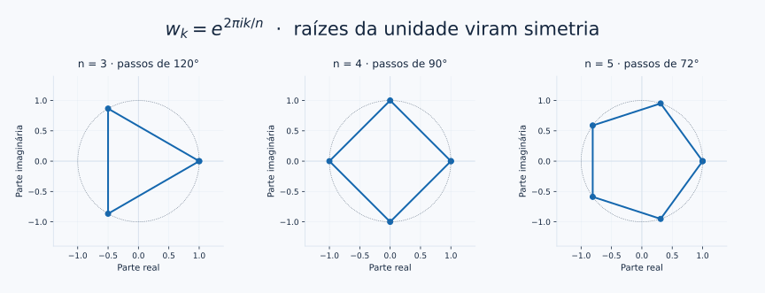

# Raízes da unidade: equações que desenham polígonos

[← Euler](04_forma_polar_euler.md) · [Entrada](../README.md) · [Aplicações →](09_onde_sao_usados.md)

Quatro multiplicações por $i$ retornam a 1. Que outros passos de rotação também completam uma volta após um número inteiro de repetições?

<a id="raizes"></a>
## Dividir uma volta em partes iguais

As soluções de $z^n=1$, para inteiro $n\ge1$, são

$$w_k=e^{2\pi i k/n},\qquad k=0,1,\ldots,n-1.$$

Cada solução tem módulo 1. Seus ângulos diferem por $2\pi/n$. Ao elevar $w_k$ a $n$, obtemos $e^{2\pi i k}=1$: um número inteiro de voltas.



Para $n\ge3$, ligar as raízes em ordem angular desenha um polígono regular. Em $n=2$, há dois pontos opostos; em $n=1$, apenas o ponto 1. O caso $n=4$ reencontra $1,i,-1,-i$.

## Veja todos os pontos voltarem a 1

**[Abra o laboratório de raízes](../notebooks/07_raizes_ondas_fourier.ipynb#raizes).** Mova $n$ de 3 para 5: o polígono muda, mas o painel à direita continua mostrando todas as potências $w_k^n$ no ponto 1. Os pequenos resíduos numéricos exibidos são efeitos de ponto flutuante.

```python
import numpy as np

n = 5
roots = np.exp(2j*np.pi*np.arange(n)/n)
print(np.round(roots**n, 12))  # Cinco valores próximos de 1
print(np.isclose(roots.sum(), 0))  # True
```

> **Uma consequência surpreendente**
> Para $n>1$, a soma das raízes é zero. A simetria equilibra os vetores em torno da origem. Algebricamente, se $w=e^{2\pi i/n}$, então $(1-w)(1+w+\cdots+w^{n-1})=1-w^n=0$; como $w\ne1$, a soma se anula.

## A ordem dos passos também importa

Gerar potências de $e^{2\pi i/n}$ visita todos os vértices. Dar passos de $m$ vértices pode visitar apenas parte deles: com $n=6$ e $m=2$, aparecem três pontos antes da repetição. O número de pontos distintos é $n/\gcd(n,m)$. O [laboratório de potências](../notebooks/06_laboratorio_interativo.ipynb#potencias) permite comparar passos de $60°$ e $120°$.

## Onde isso reaparece em computação quântica?

Esses padrões de fase entram nas matrizes da transformada discreta de Fourier e de sua versão quântica, a QFT. A estrutura $e^{2\pi i jk/N}/\sqrt N$ aparece na QFT; estudá-la como operação requer vetores, bases, matrizes e vários qubits. Reconhecer as raízes já torna o padrão menos estranho. [IBM — QFT](https://quantum.cloud.ibm.com/learning/en/courses/fundamentals-of-quantum-algorithms/phase-estimation-and-factoring/phase-estimation-procedure).

## Para aprofundar

[MIT — números complexos e raízes da unidade](https://ocw.mit.edu/courses/18-03-differential-equations-spring-2010/resources/mit18_03s10_c05/) · [OpenStax — raízes em forma polar](https://openstax.org/books/algebra-and-trigonometry-2e/pages/10-5-polar-form-of-complex-numbers) · [NumPy — DFT e convenções de sinal](https://numpy.org/doc/stable/reference/routines.fft.html).

**[Continue: onde magnitude e fase aparecem? →](09_onde_sao_usados.md)**
