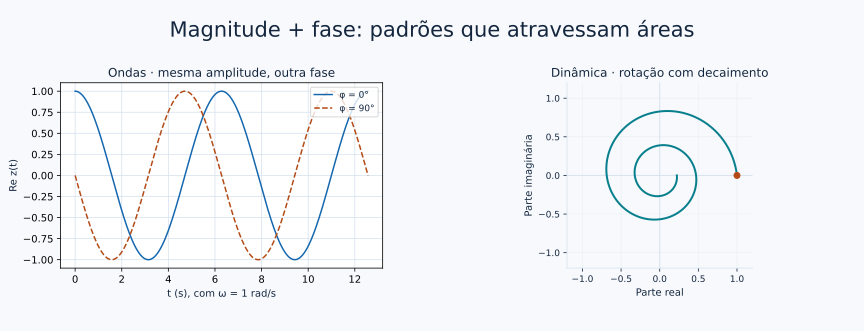

# Onde números complexos são usados?

[← Raízes da unidade](08_raizes_da_unidade.md) · [Entrada](../README.md) · [Ponte quântica →](06_ponte_para_qubits.md)

A vantagem dos números complexos aparece quando duas informações precisam andar juntas: magnitude e fase. As aplicações abaixo são janelas; cada uma identifica os conhecimentos necessários para ir além da visualização.

<a id="fase"></a>
## Fase: uma posição dentro de um ciclo

Em $z(t)=A e^{i(\omega t+\varphi)}$, $A\ge0$ controla a magnitude, $\omega$ a velocidade angular e $\varphi$ o deslocamento inicial de fase. Para $A>0$ e $\omega>0$, a projeção real é $A\cos(\omega t+\varphi)$, com período $T=2\pi/\omega$.



Na figura da esquerda, a frequência e a amplitude são iguais; muda apenas onde o ciclo começa. Com $A=0$, o sinal é nulo e não possui uma fase definida.

<a id="ondas"></a>
## Ondas, oscilações e movimento circular

**[Explore a rotação e sua projeção](../notebooks/07_raizes_ondas_fourier.ipynb#ondas).** O laboratório mostra um ponto girando e o sinal real que ele produz. Mudar a amplitude aumenta o círculo e a altura da oscilação; mudar $\omega$ altera o período.

Uma onda que varia no espaço e no tempo pode ser escrita como a parte real de $A e^{i(kx-\omega t+\varphi)}$. O número complexo reúne seno, cosseno e fase numa única expressão. Aqui $k$ é o número de onda, $x$ é posição e $t$ é tempo; as unidades precisam tornar o argumento da exponencial adimensional.

> **Janela para física**
> A representação não afirma que um deslocamento medido seja imaginário. Nesta aplicação, escolhemos a parte real para representar a grandeza física. A equação de onda e as condições do sistema determinam quais sinais são possíveis.

[MIT — ondas eletromagnéticas, anexo à aula 18](https://ocw.mit.edu/courses/6-007-electromagnetic-energy-from-motors-to-lasers-spring-2011/95bea9116bb2924f60df6860462d55c8_MIT6_007S11_lec18.pdf) e [OpenStax — rotações e diagramas de fasores](https://openstax.org/books/university-physics-volume-2/pages/15-2-simple-ac-circuits).

<a id="fasores"></a>
## Fasores e circuitos AC

Quando sinais senoidais têm uma mesma frequência angular, podemos separar a rotação comum $e^{i\omega t}$ e trabalhar com o **fasor** $\widetilde V=V_0e^{i\varphi}$:

$$v(t)=\operatorname{Re}\{\widetilde V e^{i\omega t}\}.$$

No regime senoidal permanente de um circuito linear, tensão e corrente se relacionam por uma impedância complexa: $\widetilde V=Z\widetilde I$. O módulo de $Z$ muda a escala e seu argumento dá a defasagem entre tensão e corrente.

Por exemplo, se $Z=1+i\;\Omega$ e $\widetilde I=1\;\mathrm A$, então $\widetilde V=(1+i)\;\mathrm V$: magnitude $\sqrt2\;\mathrm V$ e fase $45°$. Aqui usamos magnitudes de pico de forma consistente; a convenção RMS também é usada em engenharia.

> **Veja isto geometricamente**
> Essa relação tem a mesma forma da multiplicação de uma grade: escala + rotação. Não é preciso analisar um circuito completo para reconhecer o papel de $Z$.

Para aprofundar, entram leis de circuitos, impedância e regime permanente. Um fasor de frequência única não descreve sozinho todos os transientes ou sinais de várias frequências. [MIT — circuitos AC, capítulo 2](https://ocw.mit.edu/courses/6-061-introduction-to-electric-power-systems-spring-2011/9cf8de165233601f547b284cee5c2131_MIT6_061S11_ch2.pdf).

<a id="fourier"></a>
## Sinais e Fourier: uma forma composta de ciclos

Podemos construir um sinal somando componentes:

$$s(t)=\cos t+A\cos(kt+\varphi).$$

**[Mova a fase no laboratório de Fourier](../notebooks/07_raizes_ondas_fourier.ipynb#fourier).** A forma do sinal muda, mas as barras das amplitudes dos cossenos permanecem. Só o espectro de magnitudes não guarda toda a informação necessária para reconstruir o sinal; as fases dos coeficientes também importam.

No experimento, $k$ é inteiro entre 2 e 8 e amostramos uma volta completa com 512 pontos, sem repetir o ponto final. Essas escolhas alinham as frequências à grade da DFT e evitam misturar a demonstração com vazamento espectral. Em sinais gerais, amostragem, janelamento e aliasing exigem atenção própria.

Para um cosseno, as componentes de frequências $+k$ e $-k$ têm coeficientes conjugados, cada uma com módulo $A/2$:

$$A\cos(kt+\varphi)=\frac A2e^{i\varphi}e^{ikt}+\frac A2e^{-i\varphi}e^{-ikt}.$$

O gráfico soma a contribuição do par para exibir amplitude $A$. O NumPy usa expoente negativo na DFT direta e positivo na inversa. A convenção positiva frequentemente usada na QFT não representa uma contradição; é preciso acompanhar sinal e normalização. [Documentação da DFT no NumPy](https://numpy.org/doc/stable/reference/routines.fft.html).

<a id="dinamica"></a>
## Sistemas dinâmicos: girar enquanto cresce ou diminui

$$z(t)=e^{(\sigma+i\omega)t}=e^{\sigma t}e^{i\omega t}.$$

O fator $e^{\sigma t}$ controla crescimento ou decaimento e $e^{i\omega t}$ controla a rotação. Com $\sigma<0$, surge a espiral da figura; com $\sigma=0$, um círculo. Essa afirmação decorre diretamente da fórmula de Euler.

```python
import numpy as np
import matplotlib.pyplot as plt

t = np.linspace(0, 4*np.pi, 600)
z = np.exp((-0.12 + 1j)*t)
plt.plot(z.real, z.imag)
plt.xlabel('Re z'); plt.ylabel('Im z')
plt.axis('equal'); plt.show()
```

O [notebook de aplicações](../notebooks/07_raizes_ondas_fourier.ipynb#dinamica) também executa essa demonstração. A ligação com soluções de equações diferenciais e autovalores é uma etapa futura; a espiral, sozinha, não identifica um sistema físico específico.

## Da física à computação quântica

Na mecânica quântica, amplitudes de estados também usam números complexos, mas a probabilidade de um resultado é dada pelo módulo ao quadrado da amplitude correspondente em uma base de medição. Não obtemos uma regra de probabilidade simplesmente tomando a parte real, como no exemplo de uma onda clássica.

Na computação quântica, relações de fase reaparecem em interferência e operações sobre estados. As raízes da unidade reaparecem na QFT. Para aprofundar entram vetores, produto interno, operadores e bases. [IBM — estados quânticos](https://quantum.cloud.ibm.com/learning/en/courses/basics-of-quantum-information/single-systems/quantum-information) e [QFT](https://quantum.cloud.ibm.com/learning/en/courses/fundamentals-of-quantum-algorithms/phase-estimation-and-factoring/phase-estimation-procedure).

**[Continue: uma amplitude e um estado de qubit →](06_ponte_para_qubits.md)** · [Referências comentadas](REFERENCIAS.md)
